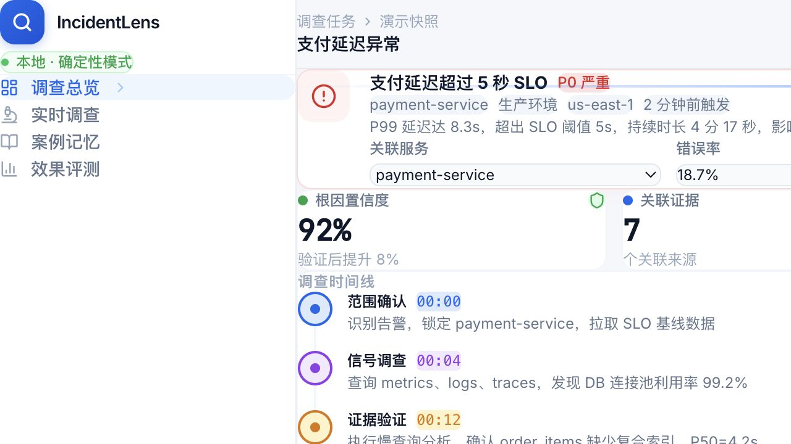
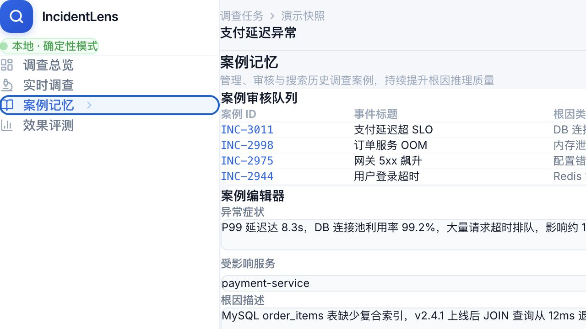
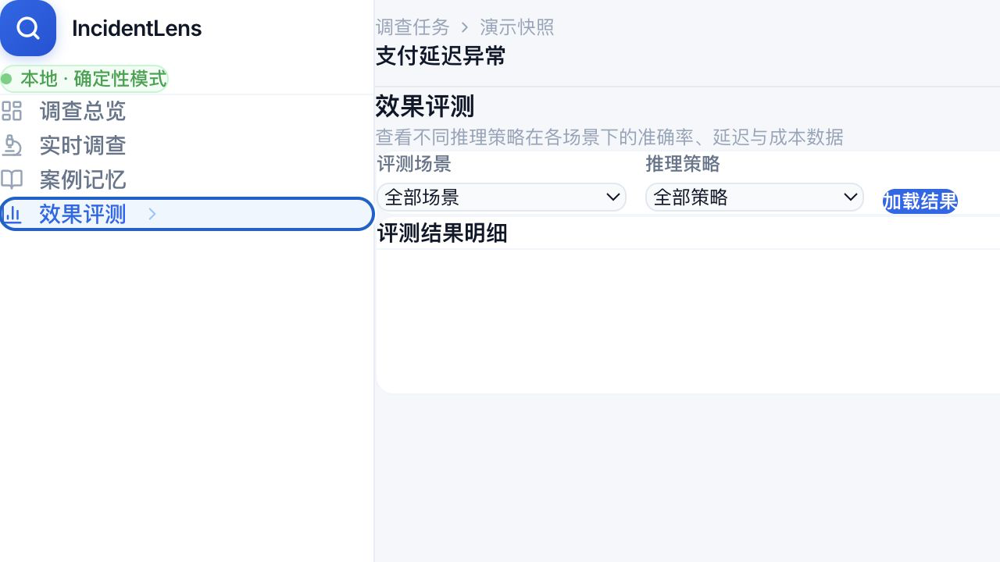
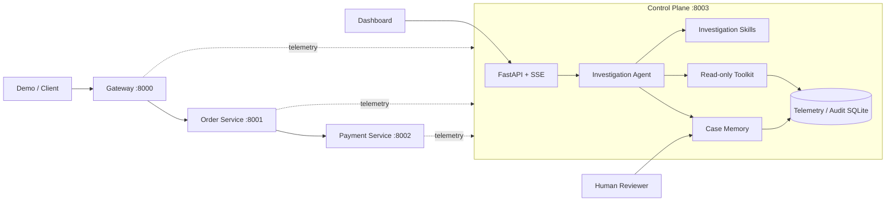
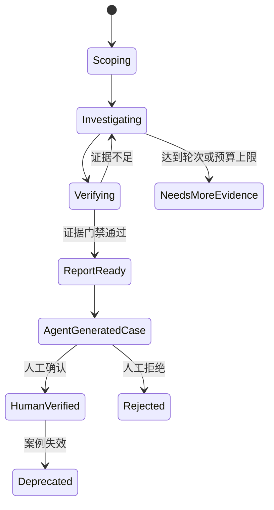

# IncidentLens

> 面向微服务故障的证据驱动型调查 Agent：从告警出发，自动收集遥测、维护假设、约束结论，并将已审核案例沉淀为可检索的团队知识。


IncidentLens 是一个可本地完整运行的 Agent 工程 MVP。仓库内置 4 个微服务、5 类故障注入场景、只读诊断工具、调查状态机、SSE 事件流、案例知识闭环和离线评估框架，可用于演示一条从“制造故障”到“产出可追溯调查报告”的完整链路。

> 项目边界：当前版本用于 Agent 工程研究、开发与面试演示，不是可直接接管生产告警的自动化运维平台；它不会执行重启、回滚或扩容等写操作。

## 效果预览



这是确定性模式下的真实页面快照：告警上下文、调查时间线、证据链、候选根因、根因报告和处置建议均由页面状态渲染。页面同时提供数字滚动、时间线渐入、状态脉冲、证据卡片悬浮和视图切换动画。完整页面启动后访问 [http://localhost:8003](http://localhost:8003)，也可以查看[可编辑的 Figma 设计稿](https://www.figma.com/design/wFVXruMTmTATUxZrPlV6Fu)。

### 功能分块展示

#### 1. 实时调查总览

从一条 P0 告警开始，页面集中呈现服务、环境、SLO、错误率和症状描述；调查推进后，时间线按阶段展示范围确认、信号调查、证据验证和报告生成。


#### 2. 证据链与根因报告

右侧证据链把指标、Trace、连接池和部署信息拆成可核对的证据卡片；根因报告同步给出置信度、关键发现与可执行的处置建议，避免只展示一句没有依据的结论。


#### 3. 案例记忆

案例记忆独立成页，拆分为审核队列、案例编辑器、混合检索、案例反馈、审计历史和 JSON 导出，便于演示“调查结果如何沉淀为团队知识”。



#### 4. 效果评测

效果评测页提供场景与推理策略筛选，并预留准确率、召回率、延迟和成本结果表，用于展示 Agent 从 Demo 走向可量化评估的完整闭环。



## 它解决什么问题

传统故障排查往往依赖工程师在日志、指标、Trace 和变更记录之间反复切换。普通 ReAct Agent 又容易出现重复查询、证据不足便下结论，或者直接照搬历史案例的问题。IncidentLens 将调查过程拆成受约束的状态机：

1. 接收告警并限定受影响服务与 Trace 范围；
2. 根据故障特征加载对应调查 Skill；
3. 只调用只读诊断工具，所有结果统一封装为 `ToolResult`；
4. 将观察结果登记为可引用 Evidence，并持续更新或排除 Hypothesis；
5. 只有满足证据策略和置信度边界时，才生成结构化调查报告；
6. 报告自动生成待审核案例，经人工确认后进入正式检索；
7. 新事件可召回历史案例，但历史结论只能作为候选假设，不能替代当前证据。

## 核心能力

| 能力 | 实现方式 | 工程价值 |
|---|---|---|
| 有状态调查 Agent | LangGraph、SQLite checkpoint、分阶段状态机 | 支持多轮调查、恢复与审计 |
| 证据约束 | Evidence ID、置信度阈值、独立证据源策略 | 降低无依据结论和“历史答案照抄” |
| 只读工具层 | 日志、指标、Trace、部署及依赖查询 | 调查与处置解耦，控制副作用 |
| 场景化 Skill | `SKILL.md` + `evidence-policy.yaml` | 将调查方法和证据标准显式化 |
| 实时可视化 | FastAPI + SSE + 原生 Web Dashboard | 展示状态、工具调用、证据和报告 |
| 知识闭环 | FTS5、可选 Embedding、混合检索、版本化审核 | 将已验证经验复用于后续事件 |
| 可评估性 | 三种策略、8 项指标、5 类故障场景 | 避免只凭 Demo 主观判断 Agent 效果 |
| 防泄漏导出 | 版本化 JSON、敏感字段清洗、大小限制 | 为复盘和离线分析提供安全边界 |

## 系统架构



控制面与业务服务通过 HTTP 交互。业务流量沿 `Gateway → Order → Payment` 传播，各服务把带 `trace_id` 的日志、指标、Span 和变更事件发送到控制面，Agent 再通过只读工具对当前事件进行调查。

### Agent 调查状态



## 真实验证结果

以下结果不是 README 中写死的模拟分数。单元与静态检查、5 场景 Demo 均于 **2026-08-04** 在本仓库工作区重新执行；完整知识闭环集成门禁来自仓库内可追溯的验证记录。

### 当前代码质量门禁

| 检查 | 命令 | 结果 |
|---|---|---:|
| 单元与非联网测试 | `uv run pytest -m 'not integration and not live_llm' -q` | **410 passed**, 34 deselected |
| 代码规范 | `uv run ruff check . --exclude .claude` | **All checks passed** |
| 静态类型 | `uv run mypy apps packages` | **75 个源文件，0 issues** |
| Dashboard 回归 | `uv run pytest tests/web/test_dashboard_contract.py -q` | **4 passed** |

### Docker Compose 端到端演示

运行 `uv run python scripts/run_demo.py --all --compose`，5 个场景全部通过报告契约：定位到预期根因服务、报告包含当前调查的 Evidence ID，并且公开输出不泄露场景标签。

| 故障场景 | 注入位置 | 定位服务 | Evidence 引用数 | 调查轮次 | 结果 |
|---|---|---|---:|---:|---:|
| `payment_delay` | payment-service | payment-service | 3 | 3 | PASS |
| `payment_error_rate` | payment-service | payment-service | 1 | 4 | PASS |
| `db_pool_exhaustion` | order-service | order-service | 1 | 4 | PASS |
| `dependency_unavailable` | order-service | order-service | 1 | 4 | PASS |
| `deployment_regression` | payment-service | payment-service | 1 | 7 | PASS |
| **合计** | 5 类故障 | **5 / 5 服务定位正确** | **7** | **平均 4.4** | **100%** |

这里的 `100%` 仅表示本次确定性验收中的“根因服务定位 + 非空证据引用”契约通过率，不等同于真实生产流量上的 LLM 根因准确率。根因类型、重复调用、首个有效假设轮次和误导案例率应通过下方 Evaluation 流程单独测量。

### 已留档的知识闭环集成门禁

`docs/phase-5-live-verification.md` 记录了 commit `5153c96` 上的完整 Compose 验证：

- **31 passed in 343.43s**；
- 覆盖全部 5 个故障场景；
- 覆盖报告证据可追溯、案例自动生成、人工确认、历史召回、误导案例标记、反馈持久化和版本化导出；
- 无豁免失败。

## 五分钟快速开始

### 环境要求

- Python `>=3.12,<3.13`
- [uv](https://docs.astral.sh/uv/)
- Docker Engine / Docker Desktop，并支持 `docker compose`
- 建议至少预留 4 GB 可用内存
- 端口 `8000`、`8001`、`8002`、`8003` 未被占用

### 1. 安装依赖

```bash
git clone <your-repository-url>
cd incidentlens
uv sync --frozen
```

### 2. 以确定性模式启动完整环境

确定性模式不请求外部模型、不需要 API Key，最适合首次体验、回归测试和面试现场演示。

```bash
INCIDENTLENS_AGENT_MODE=deterministic_baseline \
docker compose -f infra/compose/compose.yaml up -d --build
```

检查服务状态：

```bash
docker compose -f infra/compose/compose.yaml ps
curl http://localhost:8000/healthz
curl http://localhost:8003/healthz
```

4 个容器都应进入 `healthy`，两个健康检查均返回 `{"status":"ok"}`。

### 3. 跑一次真实服务链路

```bash
uv run python scripts/run_demo.py --scenario payment_delay --compose
```

这个命令会自动完成：清理旧状态、启用 6 秒支付延迟、等待配置传播、经过 Gateway 发送订单、启动调查、多轮收集证据、验证报告契约以及清理场景。

预期输出结构如下，ID 每次运行都会变化：

```text
payment_delay: passed
  incident_id: <runtime-generated-id>
  root_service: payment-service
  evidence_ids: [<evidence-id>, ...]
  rounds_completed: 3
```

运行全部场景：

```bash
uv run python scripts/run_demo.py --all --compose
```

打开 Dashboard：

```text
http://localhost:8003
```

### 4. 停止环境

```bash
# 停止容器，保留 SQLite 数据卷
docker compose -f infra/compose/compose.yaml down

# 同时删除数据卷，完全清空本地数据
docker compose -f infra/compose/compose.yaml down -v
```

## 使用方式

### 方式 A：一键场景演示（推荐）

```bash
# 单场景
uv run python scripts/run_demo.py --scenario deployment_regression --compose

# 全场景
uv run python scripts/run_demo.py --all --compose

# 自定义流量数
uv run python scripts/run_demo.py --all --compose --traffic-count 5

# 单独生成正常业务流量
uv run python scripts/generate_traffic.py --count 20 --url http://localhost:8000

# 通过公开 API 重置 Demo 状态
uv run python scripts/reset_demo.py
```

可选场景：

| 场景名 | 故障参数 | 预期根因服务 | 目标调查 Skill |
|---|---|---|---|
| `payment_delay` | 支付处理延迟 | payment-service | `downstream-timeout` |
| `payment_error_rate` | 支付错误率升高 | payment-service | `downstream-error` |
| `db_pool_exhaustion` | 数据库连接池耗尽 | order-service | `database-pool-exhaustion` |
| `dependency_unavailable` | 下游依赖不可达 | order-service | `dependency-unavailable` |
| `deployment_regression` | 新版本引入回归 | payment-service | `deployment-regression` |

### 方式 B：通过 Dashboard 调查

1. 打开 `http://localhost:8003`；
2. 选择告警服务，填写错误率和症状；
3. 点击 **Start Investigation**；
4. 观察 Timeline、Hypotheses、Tool Calls 和 Evidence；
5. 报告生成后确认或拒绝结论；
6. 在 Case Review Queue 中补充根因、处置方法及适用版本，再确认进入检索。

Dashboard 是本地演示界面，没有登录和权限控制，请勿直接暴露到公网。

### 方式 C：直接调用 API

```bash
# 启动调查
curl -X POST http://localhost:8003/api/investigations/start \
  -H 'Content-Type: application/json' \
  -d '{
    "service": "payment-service",
    "error_rate": 0.3,
    "symptom": "payment timeout"
  }'

# 使用上一步返回的 incident_id 推进一轮
curl -X POST \
  http://localhost:8003/api/investigations/<incident_id>/round

# 导出脱敏后的调查记录
curl -OJ \
  http://localhost:8003/api/investigations/<incident_id>/export

# 搜索已人工确认的历史案例
curl --get http://localhost:8003/api/cases/search \
  --data-urlencode 'q=payment timeout' \
  --data-urlencode 'service=payment-service'
```

调查事件流：

```bash
curl -N \
  http://localhost:8003/api/investigations/<incident_id>/events
```

SSE 事件包括 `state_changed`、`tool_called`、`evidence_recorded` 和 `report_ready`。

## Agent 运行模式与模型配置

### `deterministic_baseline`

- 不访问外部 LLM；
- 输出可重复，适合本地验收和 CI；
- 用于验证状态机、服务调用、证据链和 API 契约；
- 不能代表真实模型的泛化能力。

### `llm_agent`

Compose 默认模式是 `llm_agent`。当前 `config/models.yaml` 配置了一个 OpenAI-compatible 的讯飞星火 XOPGLM profile：

```bash
export INCIDENTLENS_AGENT_MODE=llm_agent
export INCIDENTLENS_LLM_ACTIVE_MODEL=xfyun-xopglm51
export XFYUN_MAAS_API_KEY='<your-api-key>'

docker compose -f infra/compose/compose.yaml up -d --build
```

注意事项：

- 不要将 Key 写入 `config/models.yaml`、Compose 文件或提交到 Git；
- 模型请求可能产生费用，且单次调查耗时明显高于确定性模式；
- 当前 provider canary 已有通过记录，但完整真实模型 Compose 验收仍标记为待完成，详见 `docs/phase-4-live-verification.md`；
- 切换模型时应先运行 `tests/live_llm/test_model_contract.py`，验证普通工具调用和结构化结论能力。

```bash
uv run pytest tests/live_llm/test_model_contract.py -m live_llm -vv -s
```

## Evaluation

评估框架比较三种策略：

| 策略 | 案例记忆 | 证据校验 | 用途 |
|---|---:|---:|---|
| `react_no_memory` | 否 | 否 | 纯 ReAct 基线 |
| `memory_unverified` | 是 | 否 | 观察未校验记忆带来的收益与风险 |
| `incidentlens_verified` | 是 | 是 | 完整 IncidentLens 策略 |

运行所有策略和场景：

```bash
uv run python -m incidentlens_evaluation.cli \
  --strategy all \
  --scenario all
```

指定策略和场景，并把结果写入指定数据库：

```bash
uv run python -m incidentlens_evaluation.cli \
  --strategy incidentlens_verified \
  --scenario payment_delay \
  --database-url sqlite:///control_plane.db
```

框架从实际 RunRecord 计算 8 项指标：根因服务准确率、根因类型准确率、证据引用正确率、首个有效假设轮次、平均工具调用数、重复调用率、历史案例误导率和平均调查延迟。详细定义见 [`docs/evaluation.md`](docs/evaluation.md)。

## 测试与开发

```bash
# 默认单元测试，不启动外部服务
INCIDENTLENS_AGENT_MODE=deterministic_baseline \
uv run pytest -m 'not integration and not live_llm' -q

# 规范和类型检查
uv run ruff check . --exclude .claude
uv run mypy apps packages

# 完整确定性 Compose 集成门禁
INCIDENTLENS_AGENT_MODE=deterministic_baseline \
uv run pytest \
  tests/integration/test_compose_flow.py \
  tests/integration/test_scenario_acceptance.py \
  tests/integration/test_memory_governance_flow.py \
  -m integration -q
```

测试拓扑刻意分层：普通单元测试禁止真实网络连接；`integration` 需要已启动的 Compose；`live_llm` 会访问真实模型提供方，必须显式选择。

## 部署流程

当前推荐部署形态是单机 Docker Compose，适合本地演示、开发联调和受控内网环境。

### 构建与启动

```bash
export INCIDENTLENS_AGENT_MODE=deterministic_baseline
docker compose -f infra/compose/compose.yaml build
docker compose -f infra/compose/compose.yaml up -d
docker compose -f infra/compose/compose.yaml ps
```

同一份多阶段镜像通过 `SERVICE` 环境变量启动不同入口：`gateway`、`order`、`payment` 或 `control-plane`。Control Plane 使用命名卷 `control-plane-data` 持久化遥测、调查审计、案例和 Agent checkpoint；`config/` 与 `skills/` 以只读卷挂载。

### 发布前检查

```bash
# 所有容器应为 healthy
docker compose -f infra/compose/compose.yaml ps

# API 与 Dashboard
curl -f http://localhost:8003/healthz
curl -f http://localhost:8003/ >/dev/null

# 冒烟场景
uv run python scripts/run_demo.py \
  --scenario payment_error_rate \
  --compose

# 查看最近日志
docker compose -f infra/compose/compose.yaml logs \
  --tail=100 control-plane
```

### 更新与回滚

```bash
# 更新：重新构建并原地替换容器，命名卷保持不变
docker compose -f infra/compose/compose.yaml up -d --build

# 查看镜像和启动问题
docker compose -f infra/compose/compose.yaml ps
docker compose -f infra/compose/compose.yaml logs --tail=200
```

当前仓库没有数据库备份脚本和正式镜像版本策略。重要环境更新前，应先备份 Docker 命名卷；回滚时需要同时保证代码与 SQLite schema 兼容。

### 上生产前必须补齐

- 在 Dashboard/API 前增加 TLS、身份认证、授权、限流与审计接入；
- 不要将 `8000–8003` 直接绑定到公网，至少通过反向代理和网络策略收敛入口；
- 当前 SQLite、进程内 SSE bus 和本地 checkpoint 更适合单实例部署，横向扩展前需替换为共享数据库、消息系统与分布式 checkpoint；
- 建立模型超时、重试、预算、熔断和 provider fallback 策略；
- 增加数据保留、备份恢复、Schema migration 和灾难恢复演练；
- 将只读工具接入真实可观测性平台时，继续执行最小权限和查询范围限制。

## 数据与安全边界

- 所有诊断工具只读，不执行自动修复；
- `confidence > 0.70` 的结论必须引用 Evidence；
- 历史案例只能生成候选假设，不能直接确认根因；
- 只有 `human_verified` 案例进入正式检索；
- 导出会过滤 API Key、Token、Authorization 等敏感字段；
- 公开 Demo 输出不会暴露内部 `root_cause_label`；
- `docker compose down` 保留数据，`down -v` 会不可逆删除本地命名卷。

## 关键 API

| 方法 | Endpoint | 说明 |
|---|---|---|
| `POST` | `/api/telemetry/events` | 写入服务遥测事件 |
| `POST` | `/api/investigations/start` | 创建调查 |
| `POST` | `/api/investigations/{id}/round` | 推进一轮调查 |
| `POST` | `/api/investigations/{id}/resume` | 从 checkpoint 恢复 |
| `GET` | `/api/investigations/{id}/events` | 订阅 SSE 调查事件 |
| `GET` | `/api/investigations/{id}/export` | 导出脱敏调查记录 |
| `GET` | `/api/cases/search` | 混合检索已验证案例 |
| `POST` | `/api/cases` | 创建草稿案例 |
| `POST` | `/api/cases/{id}/confirm` | 人工确认案例 |
| `POST` | `/api/cases/{id}/feedback` | 记录案例相关性反馈 |
| `GET` | `/api/scenarios` | 查看故障场景 |
| `POST` | `/api/scenarios/{name}/enable` | 启用故障注入 |
| `POST` | `/api/scenarios/reset` | 清理场景和 Demo 数据 |
| `GET` | `/api/evaluations/comparison` | 查看策略评估结果 |
| `GET` | `/healthz` | 健康检查 |

## 项目结构

```text
incidentlens/
├── apps/
│   ├── control-plane/       # Agent、API、SSE、Dashboard、案例治理
│   ├── gateway-service/     # 请求入口与遥测上报
│   ├── order-service/       # 订单服务及故障注入点
│   ├── payment-service/     # 支付服务及故障注入点
│   └── shared-service/      # 服务间共享运行时与遥测客户端
├── packages/
│   ├── contracts/           # Pydantic 公共契约
│   ├── telemetry/           # 遥测模型、数据库和 Repository
│   ├── scenarios/           # 故障场景定义与状态存储
│   ├── demo/                # E2E DemoRunner
│   └── evaluation/          # 策略对比与指标计算
├── skills/                  # 调查 Skill、证据策略与参考资料
├── config/models.yaml       # 模型 profile 配置
├── infra/compose/           # Dockerfile 与 Compose 编排
├── scripts/                 # 流量、演示、重置脚本
├── tests/                   # 单元、Web、集成和真实模型测试
└── docs/                    # 设计、评估与阶段验证记录
```

## 常见问题

### Compose 启动时报模型配置或 API Key 错误

Compose 默认是 `llm_agent`。首次运行请显式使用：

```bash
INCIDENTLENS_AGENT_MODE=deterministic_baseline \
docker compose -f infra/compose/compose.yaml up -d --build
```

### 端口已占用

```bash
lsof -nP -iTCP:8000 -iTCP:8001 -iTCP:8002 -iTCP:8003 -sTCP:LISTEN
```

停止冲突进程，或修改 `infra/compose/compose.yaml` 左侧的宿主机端口；修改后同步调整 DemoRunner 的 URL 参数。

### 场景结果被上一次运行污染

```bash
uv run python scripts/reset_demo.py
```

仍需完全清空时，再执行 `docker compose -f infra/compose/compose.yaml down -v`。后者会删除全部本地持久化数据。

### Dashboard 打开但没有评估结果

Evaluation 表只展示已持久化的真实运行记录，不填充演示占位数据。先执行 Evaluation CLI，并确保它写入 Control Plane 使用的数据库。

## 进一步阅读

- [评估方法与指标定义](docs/evaluation.md)
- [Phase 5 知识闭环验证记录](docs/phase-5-live-verification.md)
- [Phase 4 模型收敛验证状态](docs/phase-4-live-verification.md)
- [Phase 3 真实模型调查记录](docs/phase-3-live-verification.md)
- [知识闭环设计](docs/superpowers/specs/2026-07-31-incidentlens-phase-5-knowledge-loop-design.md)

---

如果你想快速理解这个项目，建议按这个顺序：先跑 `payment_delay` Demo，看 Dashboard 中 Evidence 如何驱动 Hypothesis；再阅读 Agent 状态机和证据策略；最后运行三种 Evaluation 策略，观察“记忆”与“证据校验”分别改变了什么。
