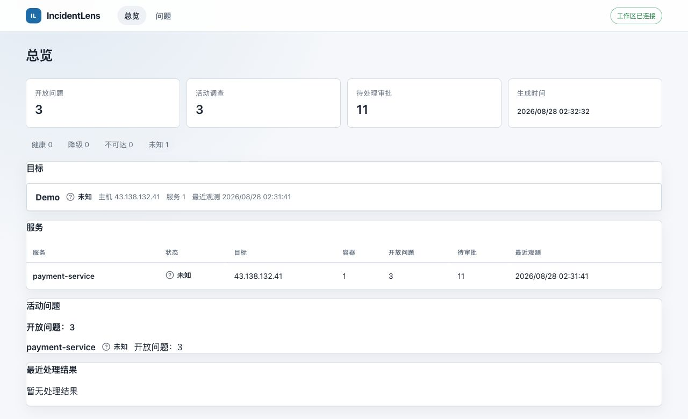

# IncidentLens

> 面向已注册云主机的安全优先事故调查控制面：让 Agent 查得深，也让每一次远程动作都可解释、可审批、可追溯。

IncidentLens 把项目注册、脱敏日志、证据、受限 Agent 调查、人工审批、变更备份和调查报告串成一条持久化链路，让 LLM 在明确的权限、证据和恢复边界内参与生产故障调查。

## 演示

在真实 Tencent CVM 微服务目标上，Agent 从受限证据开始调查：展示工具调用和完整命令，在风险操作前暂停等待操作员审批，再继续执行与远程验证。CLI、Web 和控制面共享同一条持久化调查链路。

<video controls muted loop playsinline width="100%" poster="https://github.com/luoyu0547/incidentlens/raw/refs/heads/main/docs/assets/demo-run-20260828-final/cli-approval.png">
  <source src="https://github.com/luoyu0547/incidentlens/raw/refs/heads/main/docs/assets/demo-run-20260828-final/incidentlens-cli-agent-demo-30s.mov" type="video/quicktime" />
  <a href="docs/assets/demo-run-20260828-final/incidentlens-cli-agent-demo-30s.mov">观看 CLI Agent 演示视频</a>
</video>

| Web：实时工作区总览                                                     |
| ----------------------------------------------------------------------- |
|  |

[观看 30 秒 CLI Agent 演示视频](docs/assets/demo-run-20260828-final/incidentlens-cli-agent-demo-30s.mov) · 仅录制 CLI Terminal 窗口。

审批卡会展示精确命令，并提供 `yes`、`no`、`yes all` 三个选择；`yes all` 只作用于当前对话 session，不保存审批理由。

### 真实云端验收

在一次受控 Tencent CVM 验收中，`deepseek-v4-flash` 通过正常 Agent Loop 定位两个独立回归（payment 拒付阈值、canary 数据库端口），完成修复、原生 changeset 回滚、重新应用与独立 SSH 复查：

| 指标                     |        结果 |
| ------------------------ | ----------: |
| Agent 运行状态           | `completed` |
| 调查轮次 / 工具调用      |     24 / 60 |
| 持久化 evidence          |       42 条 |
| 精确审批                 |       12 次 |
| 未批准 mutation          |        0 次 |
| 带 provenance 的项目记忆 |        5 条 |

验收器结果为 `passed: true`。完整的 [验收说明](docs/cloud-acceptance/hard-incident/README.md)、[manifest](docs/cloud-acceptance/hard-incident/manifest.json)、[最终矩阵](docs/cloud-acceptance/hard-incident/final-matrix.jsonl) 与[结构化 trace](docs/assets/hard-cloud-task7m.trace.jsonl) 均已保留，可按文档中的命令复核。该结果只证明受控目标上的有边界闭环能力，不代表系统可以绕过注册范围或无需审批修改任意生产主机。

## 解决什么问题

生产故障调查通常同时面对三类风险：信息分散、远程操作不可控、调查过程难以复盘。IncidentLens 的目标不是“让模型拥有一台服务器”，而是把模型限制为提出建议的 Provider，把事实和执行分别放进可验证的边界内：

```text
项目 / 目标注册
      │
      ├─ 受策略约束的 SSH、文件、容器操作
      ├─ 已脱敏的日志查询与订阅
      ▼
追加式证据库 → 有界调查运行时 → 审批 / 变更门禁 → Markdown + HTML 报告
```

所有对模型可见的外部事实都来自追加式、已脱敏的证据库。模型只能提出工具调用、委派、假设和结论；真正的执行始终经过策略、会话、审批和备份边界。

## 核心能力

| 能力               | 工程实现与价值                                                                                                    |
| ------------------ | ----------------------------------------------------------------------------------------------------------------- |
| 项目与目标注册     | SQLite 维护项目、SSH 目标、Compose 服务、容器和允许访问的路径，调查范围显式可见。                                 |
| 受限远程诊断       | 复用持久 SSH / SFTP / PTY 通道；工具按读、列举、搜索、状态和文件操作拆分，不暴露通用 Shell。                      |
| 日志 → 证据        | 主机或已注册容器日志逐行解析、脱敏并限制到 16 KiB；支持全文检索、订阅和 WebSocket 重放。                          |
| 有界 Agent Runtime | Provider 只提出方案；编排器限制轮次、工具调用、时间、输出和证据预算，支持父子运行、检查点、取消、恢复和重启恢复。 |
| 人工控制风险操作   | Docker、PTY、写文件等操作生成精确的一次性审批；`rm -rf`、重定向、管道和命令替换等危险模式永久拒绝。               |
| 可回滚远程变更     | 写入前创建本地加密备份与远端同目录时间戳备份，使用陈旧写检测和原子替换；多文件变更支持回滚。                      |
| 调查报告           | 统一生成 Markdown / HTML 报告，保留证据引用、操作和最终结论。                                                     |

## 技术栈

- **Backend / Control Plane**：Python 3.12、FastAPI、Pydantic、Uvicorn、AsyncSSH、SQLite
- **Web**：React 19、TypeScript、Vite、TanStack Router / Query / Table、Vitest、Playwright
- **CLI**：Node.js 22+、TypeScript、PTY 测试
- **工程化**：uv、npm workspaces、pytest、Ruff、ESLint、Prettier、Docker Compose

## 5 分钟本地运行

### 环境要求

- Python **3.12** 与 [uv](https://docs.astral.sh/uv/)
- Node.js **22.19+** 与 npm
- Docker 仅在运行集成 / 验收场景时需要

### 安装与离线验证

```bash
uv sync
npm install

# 后端离线测试
uv run pytest -q

# 前端、协议与 CLI 构建验证
npm run verify:cli
npm run web:verify
```

### 启动控制面与 Web

```bash
# Terminal 1 — API / Agent runtime
uv run uvicorn incidentlens_control_plane.main:app --host 0.0.0.0 --port 8000

# Terminal 2 — Web
npm run dev --workspace @incidentlens/web -- --host 0.0.0.0 --port 5173

# Terminal 3 — CLI（先执行 npm run build --workspace @incidentlens/cli）
node apps/cli/dist/cli.js
```

运行数据默认写入 `~/.incidentlens`。想隔离一次本地体验时：

```bash
export INCIDENTLENS_DATA_DIR="$(pwd)/.incidentlens-data"
uv run uvicorn incidentlens_control_plane.main:app --reload
```

### 第一次调查

1. 通过 `POST /api/projects` 注册项目、目标和服务范围。
2. 通过 `POST /api/investigations` 创建调查，再调用 `POST /api/investigations/{id}/start`，并显式传入 scope。
3. Runtime 收集脱敏证据，提出带证据引用的假设 / 结论；遇到风险操作时暂停等待审批。
4. 通过 API 查询结论、证据、变更和相关日志；报告输出到 `$INCIDENTLENS_DATA_DIR/reports/{id}.md` 与 `.html`。

主机日志调查的 scope 示例：

```json
{
  "scope": {
    "project_id": "checkout",
    "target_id": "prod-sg-1",
    "scope": "host"
  }
}
```

默认 FakeProvider 可重复、无需外部 API Key。启用任意支持 Chat Completions 的 OpenAI-compatible 模型：

```dotenv
INCIDENTLENS_AGENT_MODE=llm_agent
INCIDENTLENS_LLM_ACTIVE_MODEL=deepseek-v4-flash
INCIDENTLENS_LLM_BASE_URL=https://api.deepseek.com
INCIDENTLENS_LLM_API_KEY=your_key
```

无论使用 FakeProvider 还是真实模型，模型都只能通过同一受限 `ModelProvider` 合约提出建议，不能绕过工具白名单、scope、证据校验或审批边界。

## 安全设计：把“能做什么”写成代码约束

| 边界       | 约束                                                              |
| ---------- | ----------------------------------------------------------------- |
| 远程执行   | 不暴露通用 Shell / SSH 工具；命令分为自动读取、需审批与禁止三类。 |
| 路径访问   | 只允许注册根目录内的受限文件操作，拒绝遍历与符号链接逃逸。        |
| 日志与证据 | 不持久化或返回原始日志；先脱敏、截断，再作为证据引用。            |
| 模型输出   | 只接受白名单工具与已拥有证据的引用；无证据结论会暂停而不是编造。  |
| 高风险变更 | 审批精确且单次使用；写入前必须完成本地 + 远端双重备份。           |
| 故障恢复   | 危险的在途调用重启后标记为 `UNCERTAIN`，绝不自动重放。            |

## 一次调查的生命周期

```text
注册项目 / 目标
      ↓
创建 Investigation + 显式 scope
      ↓
读取脱敏日志 / 受限远程状态
      ↓
写入追加式 Evidence Store
      ↓
Agent 基于证据提出假设与下一步
      ├─ 低风险读取：策略校验后执行
      └─ Docker / PTY / 写入：暂停 → 精确审批 → 执行 → 远程验证
      ↓
保存 checkpoint / session memory / 审计事件
      ↓
生成 Markdown + HTML 调查报告
```

Runtime 状态与模型上下文相互分离：通过版本化 Session Memory 和最近增量重建有界上下文，完整证据按需读取。这使得取消、恢复、进程重启和上下文压缩都能有明确的持久化语义。

## 工程质量与验证

测试按风险和依赖分层，默认离线测试不依赖云主机或真实模型：

```bash
# 全量后端测试与静态检查
uv run pytest -q
uv run ruff check .

# 产品契约与 API 基础验收
uv run python scripts/check_product_contracts.py
uv run pytest tests/contracts tests/acceptance/test_product_api_foundation.py -q

# Agent harness 与确定性评估
uv run pytest tests/eval/test_harness_eval.py -q
uv run python tests/eval/runner.py --json .incidentlens/harness-eval.json

# 报告与离线端到端流程
uv run pytest tests/reports/ tests/acceptance/test_e2e_investigation.py -v

# 可选：Docker 验收
cd infra/acceptance && docker compose up -d
INCIDENTLENS_RUN_ACCEPTANCE=1 uv run pytest ../../tests/acceptance/test_docker_scenarios.py -v
```

可选的真实集成测试通过环境变量显式开启：`INCIDENTLENS_RUN_LIVE_SSH`、`INCIDENTLENS_RUN_LIVE_LOG_TESTS`、`INCIDENTLENS_RUN_LIVE_AGENT_TESTS`、`INCIDENTLENS_RUN_LIVE_MODEL_TESTS`。其中 live model harness 验证外部证据、scope / policy 绕过和未审批变更为 0，并检查工具配对与子运行 exactly-once。

验证记录： [Phase 1 本地 Runtime](docs/phase-1-local-runtime-verification.md) · [Phase 2 远程工具](docs/phase-2-remote-tools-verification.md) · [Phase 3 日志与证据](docs/phase-3-hybrid-log-evidence-verification.md) · [Phase 4 Agent Runtime](docs/phase-4-agent-runtime-verification.md)

## 产品契约与部署约束

- 稳定 API / stream schema 位于 `packages/protocol/`，由 `scripts/export_product_contracts.py` 生成，并由 `scripts/check_product_contracts.py` 检查漂移。
- 客户端必须先通过 `/api/v1/version` 协商版本；未知版本显式失败，不能静默降级。
- 当前控制面是本地单用户运行时，部署必须使用**单个 Uvicorn worker**，并挂载包含 SQLite、加密备份、checkpoint 和报告的持久化数据卷。
- 生产环境应配置认证 profile、session signing key，并运行在 TLS 反向代理之后；签名密钥和 bearer token 不进入请求体、日志或公开 schema。
- 旧 `/api/*` 路由仅作临时兼容层，可通过 `INCIDENTLENS_LEGACY_API_ENABLED` 关闭，不作为新客户端依赖。
- CLI / Web stream 连接携带并校验 schema version，断线后使用 cursor / sequence 恢复并处理 gap / backpressure 信号。

## 项目结构

```text
apps/control-plane/src/incidentlens_control_plane/
├── project_registry/  # 项目、目标、服务与路径范围
├── remote_ops/        # SSH 会话、命令/路径策略、受限文件操作
├── logs/              # 解析、脱敏、检索、订阅与关联
├── evidence/          # 追加式脱敏证据库
├── investigation/    # 有界编排器、Provider 合约、恢复与工具执行
├── approvals/         # 单次精确审批
├── changes/           # 双备份、原子修改与回滚
└── reports/           # Markdown / HTML 报告
```

`infra/acceptance/` 包含 Docker 验收用微服务和故障场景；`apps/web/` 是实时工作区；`apps/cli/` 是终端调查入口；`packages/protocol/` 是前后端共享的版本化契约；`tests/` 按领域组织离线、集成和验收测试。

## 配置参考

| 环境变量                            | 用途                                  | 默认值            |
| ----------------------------------- | ------------------------------------- | ----------------- |
| `INCIDENTLENS_DATA_DIR`             | SQLite、加密备份库与报告目录          | `~/.incidentlens` |
| `INCIDENTLENS_AGENT_MODE`           | `fake` 或 `llm_agent`                 | `fake`            |
| `INCIDENTLENS_LLM_BASE_URL`         | OpenAI-compatible API 根地址          | 未设置            |
| `INCIDENTLENS_LLM_ACTIVE_MODEL`     | 原样发送给 Provider 的模型 ID         | 未设置            |
| `INCIDENTLENS_LLM_API_KEY`          | Provider API Key                      | 未设置            |
| `INCIDENTLENS_RUN_LIVE_SSH`         | 启用真实 SSH 集成测试                 | 未设置（跳过）    |
| `INCIDENTLENS_RUN_LIVE_LOG_TESTS`   | 启用真实日志集成测试                  | 未设置（跳过）    |
| `INCIDENTLENS_RUN_LIVE_AGENT_TESTS` | 启用真实 Agent 集成测试               | 未设置（跳过）    |
| `INCIDENTLENS_RUN_LIVE_MODEL_TESTS` | 启用真实 model harness invariant 测试 | 未设置（跳过）    |

## 云端验收（可选）

验收脚本会在目标机启动 gateway、order stable / canary、payment、inventory 与 PostgreSQL；服务端口只绑定云主机 loopback。

```bash
./scripts/cloud_acceptance_target.sh provision
./scripts/cloud_acceptance_target.sh status
./scripts/cloud_acceptance_target.sh stop
```

默认目标是 SSH 配置中的 `incidentlens-tencent`，也可用 `--host` 或 `INCIDENTLENS_CLOUD_HOST` 覆盖。运行前请确认目标、凭据和网络权限属于你有权访问的环境。

## 当前范围与非目标

- 当前是本地单用户 API 服务；不承诺多租户隔离、水平扩展或高可用部署。
- 远端无需部署 IncidentLens Agent，但实际访问必须在项目注册中显式配置目标与允许范围。
- 项目刻意不提供任意 SSH Shell，也不把“模型自动修复生产环境”作为产品承诺。
- 后续可沿着多租户认证、策略配置中心、更多云厂商适配和长期审计存储继续演进。
