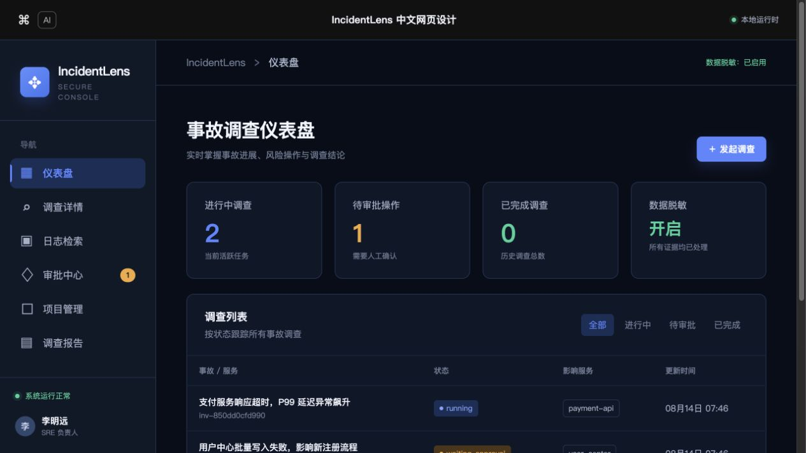
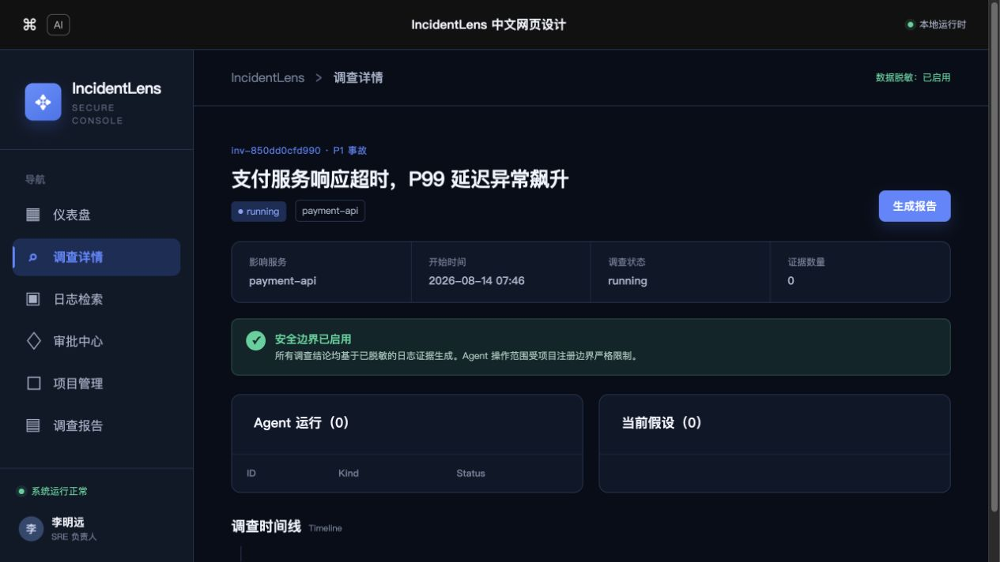
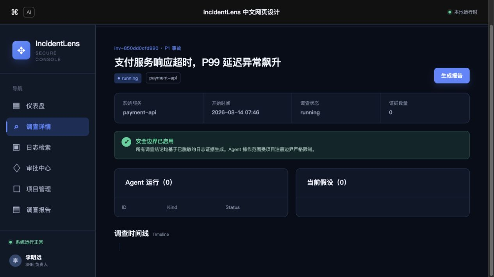
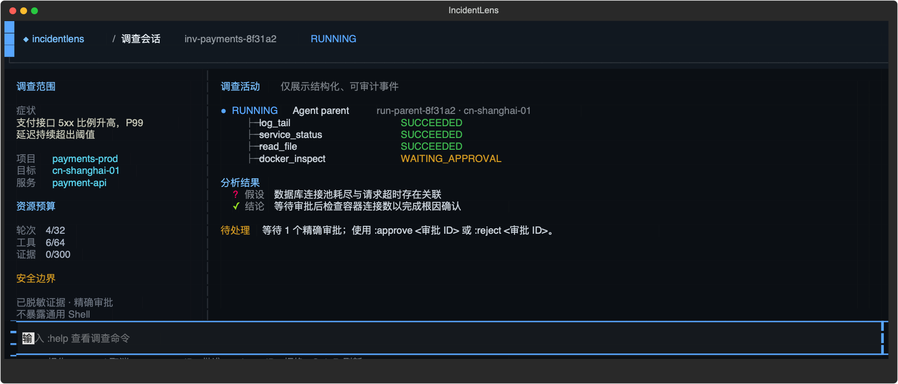
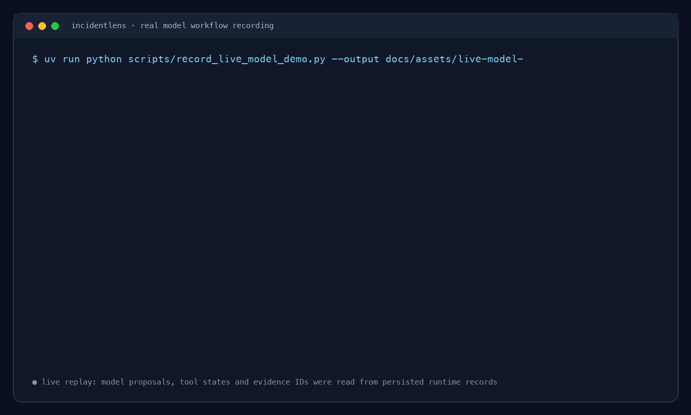
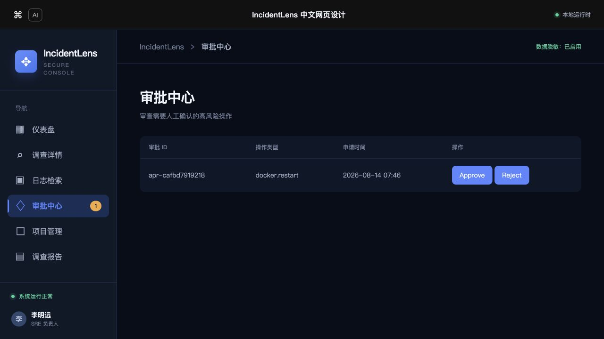
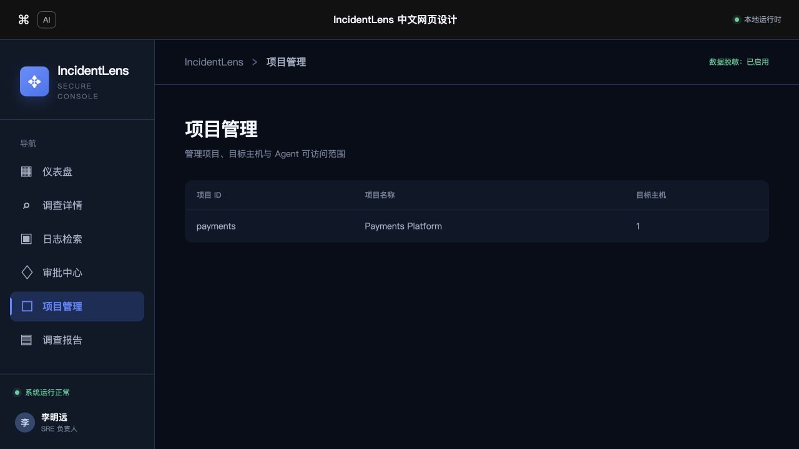
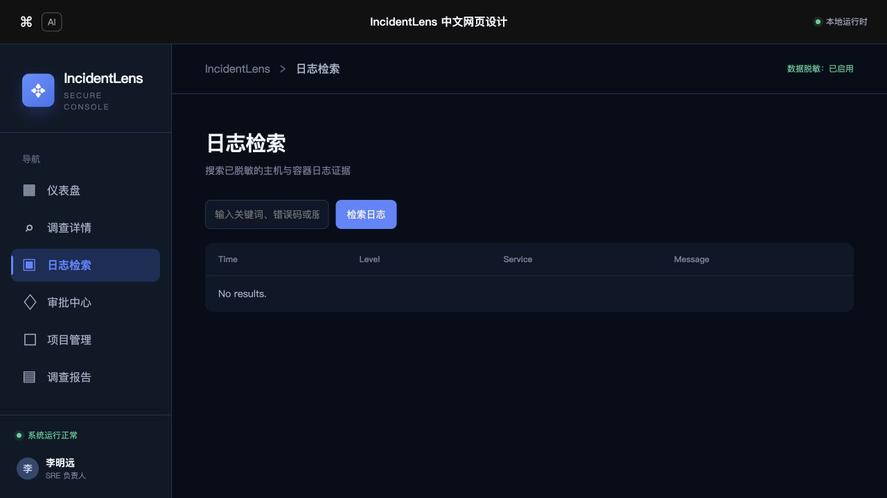
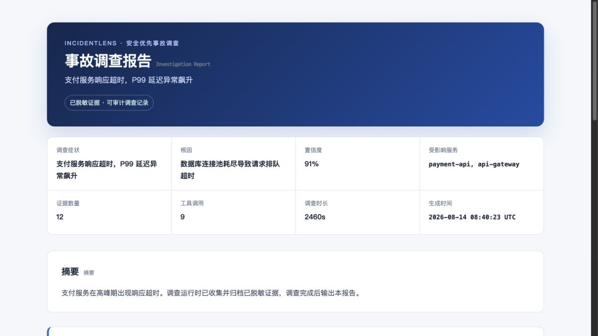

# IncidentLens

> 面向已注册云主机的、安全优先事故调查控制台。

IncidentLens 将项目注册、脱敏日志、证据、受限 Agent 调查、人工审批、变更备份和调查报告串成一条可审计的诊断链路。它不是故障注入演示，也不会在远程服务器部署 IncidentLens agent，更不会把通用 SSH Shell 交给模型。

## 演示效果

下面的页面来自本仓库启动的本地示例实例；示例中的调查数据仅用于展示界面。所有截图均采用统一桌面视口（约 1280×720）完整捕获，不是局部裁剪。

### 统一控制台与调查总览



仪表盘集中展示进行中调查、待审批操作、调查状态、服务范围、数据脱敏状态和安全边界。

### 调查详情与时间线

| 调查概览 | 调查时间线（滚动区域） |
| --- | --- |
|  |  |

调查详情页串联 Agent 运行、日志证据、工具调用、假设、审批、子任务、变更执行和最终结论。

### 终端 CLI（Textual TUI）

CLI 不是 Web 的终端镜像，而是开发者跟进一次调查的本地会话。它直接调用 Runtime：中间区域按运行顺序展示 Agent、工具调用、假设和结论；左右两侧保留 scope、预算和安全状态；底部使用命令输入处理报告、取消和精确审批。



```bash
# 从调查列表进入，或直接打开某个调查会话
incidentlens
incidentlens investigate <investigation_id>

# 直接在终端生成并阅读该调查的 Markdown 报告
incidentlens report <investigation_id>
```

会话内支持 `:report`、`:cancel`、`:approve <审批 ID>`、`:reject <审批 ID>` 与 `:refresh`。所有显示内容均来自已脱敏证据与持久化调查记录；审批仍是精确、单次使用的授权。

### 真实模型流程录制

下方不是页面切换图：它回放了一次实际写入 Runtime 的模型运行。录制脚本启动一次性的受控 OpenSSH 容器，使用真实讯飞 MaaS `xopglm51`，模型先提出 `log_query`，运行时完成 schema、注册服务、路径与只读策略校验后才经 SSH 执行；第二回合再以持久化、脱敏的证据 ID 请求关联日志，最终形成引用证据的结论并生成双格式报告。



本次运行的原始、已脱敏记录见 [live-model-workflow.json](docs/assets/live-model-workflow.json)，实际生成的 [Markdown 报告](docs/assets/live-model-report.md) 与 [HTML 报告](docs/assets/live-model-report.html) 也一并保留。可在已配置 `XFYUN_MAAS_API_KEY` 的环境中复跑：

```bash
uv run python scripts/record_live_model_demo.py \
  --output docs/assets/live-model-workflow.json \
  --report-dir docs/assets
```

### 风险审批与资源范围

| 审批中心 | 项目管理 |
| --- | --- |
|  |  |

审批中心展示精确的一次性授权；项目管理用于维护目标主机、服务和 Agent 可访问边界。

### 日志检索与调查报告

| 脱敏日志检索 | 自包含 HTML 调查报告 |
| --- | --- |
|  |  |

日志检索、证据归档和 Markdown/HTML 报告共同组成从诊断到复盘的闭环。HTML 报告为独立中文复盘文档，适合浏览与打印。

Web UI 提供调查、审批、项目与报告入口；Textual CLI 提供相同本地运行时的终端视图。报告会同时生成 Markdown 和无需服务器即可打开的自包含 HTML 文件。

## 它解决什么问题

当生产服务出现 5xx、超时或依赖不可用时，IncidentLens 让调查在明确边界内进行：

```text
注册的项目/目标
       │
       ├── 受策略约束的 SSH、文件与容器操作
       ├── 已脱敏的日志查询与订阅
       ▼
追加式证据库 ──> 有界调查运行时 ──> 审批/变更门禁 ──> Markdown + HTML 报告
```

所有对模型可见的外部事实都来自追加式、已脱敏的证据库。模型只能提出工具调用、委派、假设和结论；真正的执行始终经过策略、会话、审批及备份边界。

## 核心能力

- **项目与目标注册**：在 SQLite 中维护项目、SSH 目标、Compose 服务、容器和允许访问的路径。
- **安全远程诊断**：每个目标复用持久 SSH/SFTP/PTY 通道；提供受限的读、列举、搜索、状态和文件操作，而非通用 Shell。
- **日志到证据**：查询主机或已注册容器日志，逐行解析、脱敏并限制到 16 KiB；支持全文检索、订阅与 WebSocket 重放。
- **有界 Agent 运行时**：Provider 只提出方案；编排器限制轮次、工具调用、时间、输出和证据预算，并支持父/子运行、检查点、取消、恢复和重启恢复。调查状态与模型上下文相互分离，Runtime 通过版本化 Session Memory 和最近增量重建有界上下文，完整证据按需读取。
- **人工可控的风险操作**：Docker、PTY、写文件等操作生成精确的一次性审批；永久拒绝 `rm -rf`、重定向、管道和命令替换等危险模式。
- **可回滚的远程变更**：写入前强制创建本地加密备份与远端同目录时间戳备份，使用陈旧写检测和原子替换；多文件变更支持回滚。
- **操作界面与报告（Phase 5）**：Jinja2 + HTMX 本地 Web UI、Textual CLI、SSE 实时事件，以及 Markdown/HTML 双格式调查报告。

## 快速开始

要求：Python **3.12**、[uv](https://docs.astral.sh/uv/)。Docker 只在运行集成/验收场景时需要。

```bash
# 安装依赖
uv sync

# 运行全部离线测试
uv run pytest -q

# 启动 API 与 Web UI
uv run uvicorn incidentlens_control_plane.main:app --reload
```

打开 <http://127.0.0.1:8000> 即可进入仪表盘。运行数据默认存储在 `~/.incidentlens`；若要隔离一次本地体验：

```bash
export INCIDENTLENS_DATA_DIR="$(pwd)/.incidentlens-data"
uv run uvicorn incidentlens_control_plane.main:app --reload
```

在另一个终端启动 CLI：

```bash
# 一次安装：将命令加入用户级 PATH（~/.local/bin）
uv tool install --editable .

# 此后可在任意目录直接启动
incidentlens
```

CLI 默认显示调查列表；可按 Enter 进入选中的调查，或直接使用 `incidentlens investigate <id>` / `incidentlens report <id>`。调查会话中可用 `:report`、`:cancel`、`:approve <id>`、`:reject <id>` 与 `:refresh`；`q` 退出。CLI 与 Web UI 共享本地 SQLite 数据库，MVP 阶段建议不要让两个进程同时执行写操作。

## 一次调查如何流转

1. 通过 `POST /api/projects` 注册项目、目标和服务范围。
2. 通过 `POST /api/investigations` 创建调查，再使用 `POST /api/investigations/{id}/start` 以限定 scope 启动或恢复它。
3. 调查运行时收集已脱敏证据、提出有证据引用的假设/结论，必要时暂停等待精确审批。
4. 在 Web UI 查看调查时间线、运行、工具调用、假设与待审批项；事件通过 SSE 推送。
5. 打开 `/web/reports/{id}` 生成并查看报告。文件默认输出至 `$INCIDENTLENS_DATA_DIR/reports/{id}.md` 和 `.html`。

API 启动调查时需要明确 scope，例如主机日志范围：

```json
{
  "scope": {
    "project_id": "checkout",
    "target_id": "prod-sg-1",
    "scope": "host"
  }
}
```

默认使用确定性的 `FakeProvider`，用于可重复的离线调查和验收。设置 `.env` 后可启用讯飞星辰 MaaS 的 OpenAI 兼容模型：

```dotenv
INCIDENTLENS_AGENT_MODE=llm_agent
INCIDENTLENS_LLM_ACTIVE_MODEL=xfyun-xopglm51
XFYUN_MAAS_API_KEY=your_key
# 可选；默认使用讯飞 Coding Plan 的 OpenAI 兼容地址
INCIDENTLENS_LLM_BASE_URL=https://maas-coding-api.cn-huabei-1.xf-yun.com/v2
```

运行时会将 `xfyun-` 前缀映射为讯飞实际 model ID（如 `xopglm51`）。无论使用 FakeProvider 还是真实模型，模型都只能通过同一受限的 `ModelProvider` 合约提出建议，不能绕过工具白名单、scope、证据校验或审批边界。

## 安全边界

| 边界 | 约束 |
| --- | --- |
| 远程执行 | 不暴露通用 Shell/SSH 工具；命令分为自动读取、需审批与禁止三类。 |
| 路径访问 | 只允许注册根目录内的受限文件操作，拒绝遍历与符号链接逃逸。 |
| 日志与证据 | 不持久化或返回原始日志；所有内容先脱敏、截断，再作为证据引用。 |
| 模型输出 | 只接受白名单工具与已拥有证据的引用；无证据结论会暂停而不是编造。 |
| 高风险变更 | 审批精确、单次使用；写入前必须完成双重备份。 |
| 故障恢复 | 危险的在途调用重启后标记为 `UNCERTAIN`，绝不自动重放。 |

## 验证

```bash
# 全量离线测试与静态检查
uv run pytest -q
uv run ruff check .

# Phase 4 harness evaluator and deterministic runner
uv run pytest tests/eval/test_harness_eval.py -q
uv run python tests/eval/runner.py --json .incidentlens/harness-eval.json

# Opt-in real MaaS invariants (reuses configured MaaS settings; skipped otherwise)
INCIDENTLENS_RUN_LIVE_MODEL_TESTS=1 uv run pytest tests/integration/test_live_model_harness.py -q

# Phase 5：CLI、Web UI、报告与离线端到端流程
uv run pytest tests/reports/ tests/cli/ tests/web/test_web_dashboard.py tests/acceptance/test_e2e_investigation.py -v

# 可选：Docker 验收场景
cd infra/acceptance && docker compose up -d
INCIDENTLENS_RUN_ACCEPTANCE=1 uv run pytest ../../tests/acceptance/test_docker_scenarios.py -v
```

其他可选的真实集成验证：

```bash
INCIDENTLENS_RUN_LIVE_SSH=1 uv run pytest tests/integration/test_live_ssh_tools.py -q
INCIDENTLENS_RUN_LIVE_LOG_TESTS=1 uv run pytest tests/integration/test_live_log_tools.py -q
INCIDENTLENS_RUN_LIVE_AGENT_TESTS=1 uv run pytest tests/integration/test_live_agent_runtime.py -q
```

详细步骤见 [Phase 1](docs/phase-1-local-runtime-verification.md)、[Phase 2](docs/phase-2-remote-tools-verification.md)、[Phase 3](docs/phase-3-hybrid-log-evidence-verification.md)、[Phase 4](docs/phase-4-agent-runtime-verification.md) 与 [Phase 5](docs/phase-5-cli-web-reports-verification.md) 验证记录。

## 项目结构

```text
apps/control-plane/src/incidentlens_control_plane/
├── project_registry/  # 项目、目标、服务与路径范围
├── remote_ops/        # SSH 会话、命令/路径策略、受限文件操作
├── logs/              # 解析、脱敏、检索、订阅与关联
├── evidence/          # 追加式脱敏证据库
├── investigation/    # 有界编排器、Provider 合约、恢复与工具执行
├── approvals/         # 单次精确审批
├── changes/           # 双备份、原子修改与回滚
├── reports/           # Markdown/HTML 报告
├── web/               # Jinja2 + HTMX + SSE Web UI
└── cli/               # Textual 终端界面
```

`infra/acceptance/` 包含用于 Docker 验收的微服务和故障场景；`tests/` 按领域模块组织离线、集成与验收测试。

## 配置

| 环境变量 | 用途 | 默认值 |
| --- | --- | --- |
| `INCIDENTLENS_DATA_DIR` | SQLite、加密备份库与报告输出目录 | `~/.incidentlens` |
| `INCIDENTLENS_RUN_LIVE_SSH` | 启用真实 SSH 集成测试 | 未设置（跳过） |
| `INCIDENTLENS_RUN_LIVE_LOG_TESTS` | 启用真实日志集成测试 | 未设置（跳过） |
| `INCIDENTLENS_RUN_LIVE_AGENT_TESTS` | 启用真实 Agent 集成测试 | 未设置（跳过） |
| `INCIDENTLENS_RUN_LIVE_MODEL_TESTS` | 启用真实 MaaS harness invariant 测试 | 未设置（跳过） |

## 当前范围

IncidentLens 是本地单用户控制台。Phase 5 交付的是交互层和报告能力，不改变前四个阶段的安全模型。远端侧无需部署 agent；实际远程访问仍需在项目注册中显式配置目标与可访问范围。
