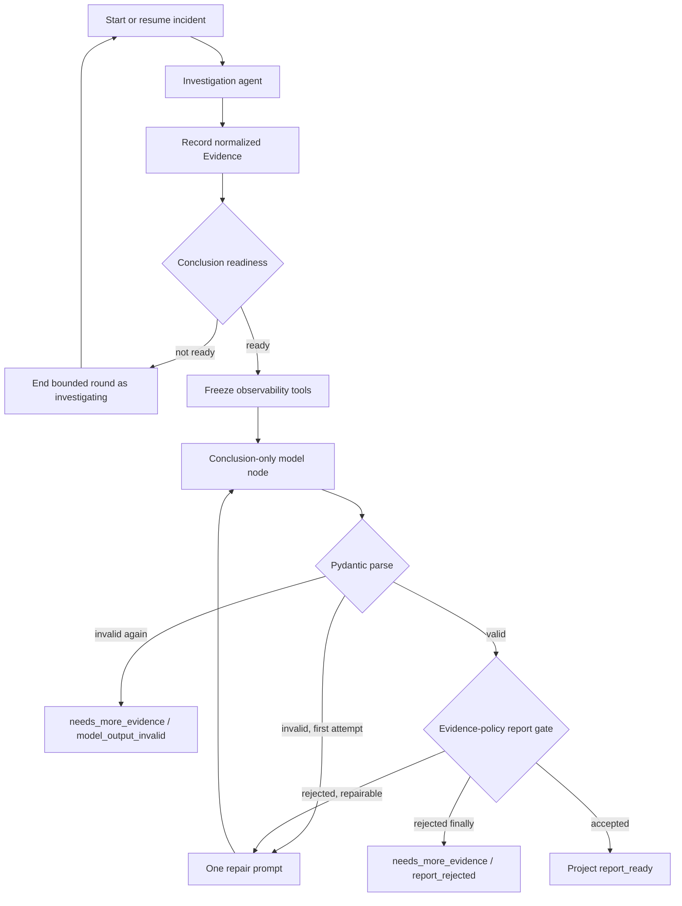

# IncidentLens Phase 4: Provider-Compatible Model Convergence

**Planning date:** 2026-07-29  
**Starting branch:** `codex/phase-3-review-fixes`  
**Starting status:** Phase 3 implementation is functional; real-provider report
convergence remains unaccepted.

## 1. Outcome

Phase 4 makes a real investigation reliably transition from evidence gathering to
a model-authored, structured root-cause proposal without introducing a fixed
root-cause strategy.

The phase is complete only when the configured provider:

1. reads the relevant Skill;
2. gathers sufficient current-incident evidence;
3. stops observability calls at a deterministic conclusion boundary;
4. emits a valid `RootCauseProposal`;
5. passes the existing evidence-policy report gate;
6. reaches `report_ready` in the real Compose `payment_delay` scenario.

## 2. Confirmed Root Cause

The current graph configures `create_agent(...,
response_format=ToolStrategy(RootCauseProposal))` for every investigation model
call.

In the repository's locked `langchain==1.3.14` implementation:

- all normal observability tools remain in `request.tools`;
- the structured-output tool is appended to those tools;
- `ToolStrategy` binds the model with `tool_choice="any"`;
- the `request.tool_choice` supplied by middleware is not used in this branch.

Consequently, setting `tool_choice` to `RootCauseProposal` in
`InvestigationContextMiddleware` does not create a conclusion-only call. The
xfyun model can continue selecting observability tools and eventually exhaust the
12-call model budget.

The live evidence already proves that this is not a telemetry-readiness problem:
the run collected five approximately six-second traces, a representative complete
trace, a 6000 ms warning log, and a `payment_latency_ms=6000` metric.

## 3. Design Boundaries

### Required

- The model remains the author of `root_service`, `cause_code`,
  `evidence_ids`, confidence, and next action.
- Evidence IDs remain server-generated and current-incident scoped.
- Skill evidence policies remain the authority for report acceptance.
- Provider selection remains configuration-only.
- Every transition and rejection is checkpointed and audited.
- Invalid structured output gets at most one bounded repair attempt.
- Terminal incidents are never silently restarted.

### Forbidden

- No hard-coded `payment_latency_spike` proposal in production code.
- No scenario-name-to-root-cause mapping in the LLM agent path.
- No deterministic baseline fallback when model output is invalid.
- No provider-name branches in investigation or report logic.
- No hidden retry loop that can consume the general investigation budget.
- No passing live-verification record when the real Compose test fails.

## 4. Target Architecture



### 4.1 Investigation node

The investigation node uses `create_agent` with registered read-only
observability tools and `response_format=None`.

It is responsible for:

- selecting and calling observability tools;
- loading Skills and references;
- gathering evidence;
- ending a bounded turn when it has no further tool call.

It is not allowed to create or publish a report.

### 4.2 Deterministic readiness node

Introduce a provider-neutral readiness evaluator that examines loaded Skill
policies and normalized Evidence.

An evidence item is material only when:

- its tool outcome is successful;
- its `data` is non-empty;
- it is not synthetic invalid-argument evidence;
- it belongs to the current incident.

A Skill policy is conclusion-ready when:

- its Skill is loaded;
- the number of independent material source tools meets
  `minimum_independent_evidence`;
- no configured direct-contradiction source is present;
- the evidence and tool budgets have not already failed.

The evaluator returns eligible policy/cause codes and supporting Evidence IDs.
It does not choose the final cause or construct a proposal.

### 4.3 Conclusion-only model node

The conclusion node uses the same configured model but binds exactly one tool:
the schema-derived `RootCauseProposal` tool, with required tool use.

Its bounded prompt contains only:

- the current incident summary;
- loaded Skill names;
- eligible cause codes;
- bounded material Evidence summaries and exact Evidence IDs;
- the instruction to choose only supported current-incident evidence.

No observability tool is available in this node. The implementation should use a
dedicated node/subgraph rather than trying to override `tool_choice` inside the
global `ToolStrategy` agent.

The result is parsed with `RootCauseProposal.model_validate`. Missing tool calls,
multiple proposal calls, malformed arguments, and schema failures are explicit
structured-output errors.

### 4.4 Report gate and repair

The existing `can_generate_guarded_report` remains the final deterministic gate.

Repair is allowed once for:

- malformed structured output;
- unknown Evidence IDs;
- insufficient cited independent evidence when qualifying evidence exists;
- a cause code outside the eligible loaded-Skill set.

The repair prompt contains the rejection code and allowed identifiers, not a
precomputed answer. A second failure terminates safely.

Direct contradiction and missing Skill errors are not silently repaired by
inventing more evidence. They return `needs_more_evidence`.

## 5. State and Audit Contract

Extend `IncidentAgentState` and `InvestigationState` with:

- `conclusion_status`: `not_ready | ready | attempting | accepted | rejected`;
- `conclusion_attempt_count`: integer, maximum 2;
- `eligible_cause_codes`: unique string list;
- `eligible_evidence_ids`: unique string list;
- `last_report_rejection_reason`: optional safe error code.

Project these fields through the runtime only if they are required by API or
evaluation consumers. Internal-only fields must still be checkpointed.

Add audit actions:

- `conclusion_boundary_entered`;
- `structured_output_attempted`;
- `structured_output_invalid`;
- `report_gate_rejected`;
- `report_gate_accepted`;
- `conclusion_terminal_failure`.

Audit details may contain model identity, attempt number, safe rejection code,
cause code, and Evidence IDs. They must not contain API keys, authorization
headers, raw prompts, or hidden reasoning.

Add or consistently use terminal error codes:

- `model_output_invalid`;
- `report_rejected`;
- `budget_exhausted`;
- `model_timeout`;
- `skill_load_failed`.

## 6. Implementation Tasks

### Task 1: Freeze the failing behavior in tests

**Modify:**

- `tests/agent/test_llm_graph.py`
- `tests/agent/test_runtime.py`

Add failing tests proving:

- normal investigation calls do not globally force structured output;
- observability tools are unavailable after the conclusion boundary;
- a model cannot issue `get_trace` from the conclusion node;
- the proposal remains model-generated;
- a second invalid conclusion terminates with `model_output_invalid`;
- a report-gate rejection reason is persisted and audited.

### Task 2: Introduce generic conclusion readiness

**Create:**

- `apps/control-plane/src/incidentlens_control_plane/agent/conclusion.py`
- `tests/agent/test_conclusion.py`

Implement pure functions/models for:

- material Evidence classification;
- policy eligibility;
- safe conclusion context construction;
- proposal parsing;
- repair classification.

Tighten `RootCauseProposal.next_action` to the literal values `finish` and
`needs_more_evidence`. Keep `cause_code` runtime-validated against eligible Skill
policies because the eligible set is incident-specific.

Cover all five Skill policies in parameterized tests. Do not encode scenario
names or expected root causes in the readiness implementation.

### Task 3: Split investigation and conclusion execution

**Modify:**

- `apps/control-plane/src/incidentlens_control_plane/agent/graph.py`
- `apps/control-plane/src/incidentlens_control_plane/agent/middleware.py`
- `apps/control-plane/src/incidentlens_control_plane/agent/prompts.py`

Changes:

1. remove the global `ToolStrategy(RootCauseProposal)` from the investigation
   agent;
2. remove the ineffective conclusion `tool_choice` override;
3. create a conclusion-only node/subgraph using the same configured model;
4. expose only the proposal schema in the conclusion node;
5. route to the report gate after successful parsing;
6. checkpoint every node transition.

### Task 4: Add bounded repair and terminal semantics

**Modify:**

- `apps/control-plane/src/incidentlens_control_plane/agent/types.py`
- `apps/control-plane/src/incidentlens_control_plane/agent/runtime.py`
- `apps/control-plane/src/incidentlens_control_plane/agent/projection.py`
- `apps/control-plane/src/incidentlens_control_plane/agent/state.py`

Requirements:

- exactly one conclusion repair;
- conclusion attempts are separate from observability tool budget;
- model calls still count toward the total model budget;
- an invalid second response becomes a terminal, explicit failure;
- `run_round` and `resume` do not restart terminal conclusion failures;
- checkpoint recovery does not repeat an accepted proposal.

### Task 5: Make report-gate decisions observable

**Modify:**

- `apps/control-plane/src/incidentlens_control_plane/agent/middleware.py`
- `apps/control-plane/src/incidentlens_control_plane/agent/state.py`
- `apps/control-plane/src/incidentlens_control_plane/routes/investigations.py`

Record safe decision codes and expose enough state for the DemoRunner and SSE
consumers to distinguish:

- still investigating;
- conclusion retry;
- report rejected;
- structured output invalid;
- general budget exhausted.

No endpoint may return a generic `needs_more_evidence` without the corresponding
safe `last_error_code`.

### Task 6: Extend the provider contract canary

**Modify:**

- `apps/control-plane/src/incidentlens_control_plane/llm/canary.py`
- `tests/live_llm/test_model_contract.py`

Keep the nonce tool-call canary and add a conclusion-schema canary that:

- binds only a synthetic proposal tool;
- requires a tool call;
- validates all proposal fields with Pydantic;
- uses synthetic Evidence IDs supplied in the prompt;
- records only redacted identity and pass/fail metadata.

This canary tests provider capability without asserting an incident root cause.

### Task 7: Graph, recovery, and concurrency verification

**Modify:**

- `tests/agent/test_llm_graph.py`
- `tests/agent/test_recovery.py`
- `tests/agent/test_investigation_engine.py`

Required cases:

- valid first conclusion;
- invalid first and valid repair;
- invalid twice;
- unknown Evidence ID;
- insufficient independent citations;
- direct contradiction;
- model timeout during conclusion;
- restart from a checkpoint before conclusion;
- restart after accepted conclusion;
- two concurrent incidents with isolated attempt counters and evidence.

### Task 8: Real Compose acceptance

**Modify:**

- `tests/integration/test_live_agent_compose.py`
- `packages/demo/src/incidentlens_demo/runner.py`
- `docs/phase-4-live-verification.md` after successful execution only

Run:

```bash
set -a
source .env
set +a
uv run pytest tests/live_llm/test_model_contract.py -m live_llm -vv -s
uv run pytest \
  tests/integration/test_live_agent_compose.py::test_real_model_completes_payment_delay_investigation \
  -m "integration and live_llm" -vv -s
```

The Compose test must assert:

- `downstream-timeout` was loaded;
- at least two independent material Evidence sources were used;
- a conclusion boundary audit exists;
- no observability tool call occurs after that boundary;
- `RootCauseProposal` was model-generated and gate-accepted;
- status is `report_ready`;
- root service is `payment-service`;
- referenced Evidence IDs are current-incident owned;
- no fallback or deterministic baseline was used.

### Task 9: Complete quality gates and documentation

Before treating mypy as a completion gate, add PEP 561 `py.typed` markers to the
typed internal workspace distributions that mypy currently treats as untyped
(`incidentlens_contracts`, `incidentlens_telemetry`, and
`incidentlens_scenarios` at minimum), and verify the markers are included in
built wheels. Do not suppress these imports globally.

Run:

```bash
uv run pytest -m "not live_llm and not integration" -q
uv run ruff check .
uv run mypy packages apps
```

Then run deterministic Compose regression:

```bash
INCIDENTLENS_AGENT_MODE=deterministic_baseline \
uv run pytest \
  tests/integration/test_compose_flow.py \
  tests/integration/test_scenario_acceptance.py \
  -m integration -q
```

Update:

- `README.md`;
- `docs/evaluation.md`;
- `docs/phase-3-live-verification.md`;
- `docs/phase-4-live-verification.md`.

The Phase 4 live record must contain actual redacted output only. If live
acceptance fails, retain the failure and do not mark the phase complete.

## 7. Execution Order and Checkpoints

1. Commit readiness models and pure unit tests.
2. Commit the graph split and conclusion-only node.
3. Commit repair, audit, projection, and recovery behavior.
4. Pass all non-live gates.
5. Rebuild Compose and run the two real-provider acceptance commands.
6. Commit live verification documentation only after both commands pass.

Each checkpoint must keep the deterministic baseline operational.

## 8. Risks and Mitigations

### Provider ignores required tool choice

Mitigation: the conclusion node exposes exactly one tool and the extended canary
verifies that contract before the Compose run. Missing tool output becomes
`model_output_invalid`; it never reopens observability tools.

### Model cites the wrong Evidence IDs

Mitigation: the prompt contains the exact eligible set, the report gate verifies
ownership, and one bounded repair receives the rejection code and allowed IDs.

### Readiness chooses a cause before the model

Mitigation: readiness identifies eligible Skill policies and evidence sets only.
The model still chooses and emits the proposal.

### Conclusion retries exhaust the investigation loop

Mitigation: store a dedicated attempt counter, cap it at two, and transition to an
explicit terminal error.

### Graph split breaks checkpoint recovery

Mitigation: checkpoint before and after readiness, conclusion, and gate nodes;
add restart tests at each boundary.

### Live tests become provider-flaky

Mitigation: separate capability canary from scenario acceptance, retain exact
failure metadata, use configured timeouts, and never rewrite a failed run as a
pass.

## 9. Definition of Done

Phase 4 is done only when all of the following are true:

- investigation calls are not globally forced into `ToolStrategy`;
- conclusion calls expose only `RootCauseProposal`;
- no observability call occurs after conclusion readiness;
- proposal parsing and gate rejection are audited;
- exactly one structured repair is possible;
- unit, graph, recovery, API, demo, lint, type, and baseline gates pass;
- the real provider canary passes;
- the real Compose `payment_delay` investigation reaches `report_ready`;
- the verification document contains actual redacted evidence;
- production code contains no fixed answer, fake-model path, or provider-specific
  root-cause branch.
